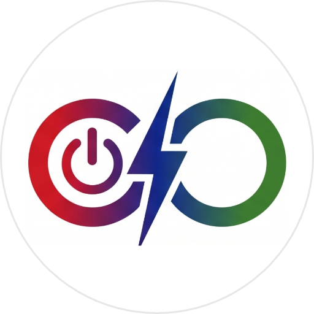
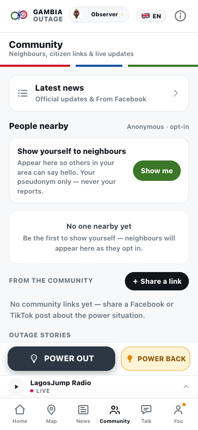

<p align="center">
  
</p>

<h1 align="center">GAMBIA OUTAGE</h1>
<p align="center"><strong>Report the Dark</strong> — a public, anonymous, community-built record of power cuts in The Gambia.</p>

<p align="center">
  <a href="https://gambiaoutage.com"><strong>📲 Use it now → gambiaoutage.com</strong></a>
  &nbsp;·&nbsp; no signup &nbsp;·&nbsp; free &nbsp;·&nbsp; EN / FR / العربية
</p>

<p align="center">
  
  
  
</p>

---

## What it is

When the power goes out in The Gambia, nobody can tell you where, since when, or
whether it's just your compound. Gambia Outage fixes that with two taps:

- **POWER OUT / POWER BACK** — report by GPS or by picking your area. No account.
- **Live national picture** — every region and quarter, dark-since / back-since times,
  community-confirmed status (a zone shows *confirmed* at 8 distinct reporters).
- **Built for cheap phones and bad networks** — installable PWA, offline report queue,
  data-saver mode, map optional.
- **Community layer** — neighbourhood updates, questions, local links, radio streams,
  and a Wall of Honor for the most active reporters. All pseudonymous.

## Why you can trust it

People here are rightly careful about apps that ask them to report things.
So this one is built to need **zero trust**:

1. **No identity exists.** No registration, no phone number, no email, no name.
   Reporting works the moment the app opens.
2. **Reports cannot be traced back to you — even by us.** Anti-abuse keys are salted
   hashes that **rotate every day**; locations are **rounded to ~1.1 km before they
   touch the disk**; your community pseudonym is mathematically unlinked from your
   reports, and an automated test suite blocks any change that would link them.
3. **The entire source code is public** — this repository *is* the app that runs at
   gambiaoutage.com. Anyone can read it, audit it, or run their own copy.
4. **Nobody can ever lock it up.** The AGPL-3.0 license makes it legally impossible
   for any company, NGO, institution — or the founder — to take this project closed.

**The full technical explanation, including its honest limits:
[docs/PRIVACY.md](docs/PRIVACY.md).** Don't trust us — verify.

## Screenshots

| Onboarding | Home | Your identity | Community |
|---|---|---|---|
|  |  |  |  |

**→ [Full screenshot gallery](docs/SCREENSHOTS.md)** — the map, all 7 regions and 55 quarters, news, community, Wall of Honor, languages and radio.

## Install it (for everyone)

Gambia Outage is a **PWA** — it installs from the browser, no app store needed:

1. Open **[gambiaoutage.com](https://gambiaoutage.com)** in Chrome or Safari.
2. **Android/Chrome:** menu ⋮ → *Add to Home screen*. **iPhone/Safari:** Share → *Add to Home Screen*.
3. That's it. It works offline and queues your reports until you're back online.

## Run it yourself (for developers)

```bash
# 1. Frontend (React 18 + Vite + TS + Tailwind)
pnpm -C web install
pnpm -C web dev                  # http://localhost:5173

# 2. Backend (PocketBase + JS hooks)
cd pb && ./setup.sh              # downloads PocketBase, applies migrations
./pocketbase serve --http 127.0.0.1:8090

# 3. Seed The Gambia's zones & demo data
pnpm -C data seed

# 4. Tests (includes the anonymity invariants)
pnpm -C web test
```

Architecture notes live in [CLAUDE.md](CLAUDE.md) (yes — this project is built with
AI assistance, in the open). Configuration reference: [.env.example](.env.example).

## Contributing

All of it counts, not just code — see [CONTRIBUTING.md](CONTRIBUTING.md):

- 🌍 **Translations** — the app ships in English, French and Arabic; **Wolof and
  Mandinka are wanted** and the i18n system is ready for them.
- 🗺️ **Zone coverage** — know a quarter or village we're missing? Open an issue.
- 🐛 **Testing & bug reports** — use the app, tell us where it fails.
- 💻 **Code** — the stack is React + PocketBase; CI enforces the privacy invariants.

## Mission & stewardship

Gambia Outage is built **for Gambians, as a public good**. It is open source so that
no single company, NGO or institution — including its founder — can ever own or
close it. The long-term goal is **Gambian stewardship**: as local maintainers emerge,
governance transfers to them. The path is written down in
[GOVERNANCE.md](GOVERNANCE.md).

## License

[AGPL-3.0](LICENSE) — use it, study it, improve it, run your own instance; if you
host a modified version, you must share your changes. The "Gambia Outage" name and
logo are not part of the code license: see [TRADEMARK.md](TRADEMARK.md).
