# Screenshots — Gambia Outage

A tour of the live app at [gambiaoutage.com](https://gambiaoutage.com), captured on
a 390×844 mobile viewport (the target device: a cheap phone on a slow network).
Everything works with **no account and no sign-up**.

> All figures shown are live community data. Personal identity never appears —
> reporting is anonymous by construction (see [PRIVACY.md](PRIVACY.md)).

## First run

No registration, no permissions you don't want to give. The splash explains what
the app is in one line; location is optional; you can be reporting in two taps.

| Onboarding | Home — the national picture | About & methodology |
|:--:|:--:|:--:|
| 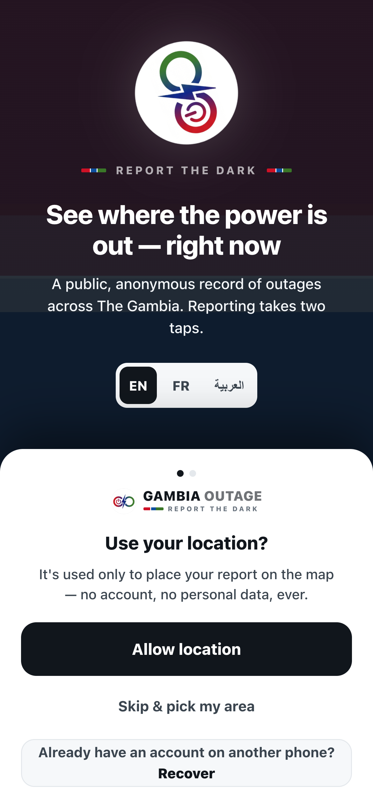 | 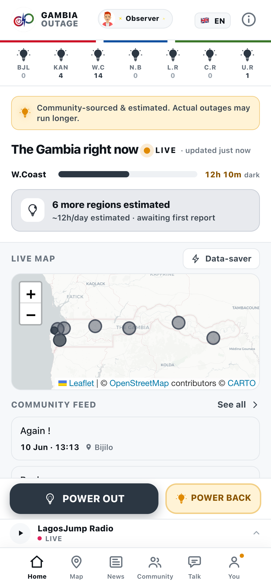 | 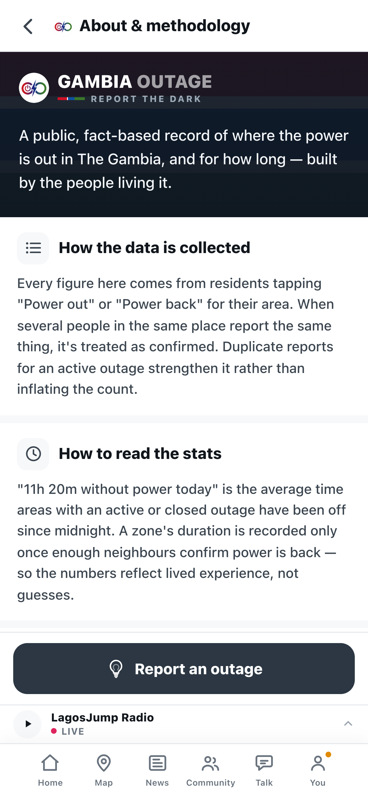 |
| Splash + optional location — *"no account, no personal data, ever."* | Live status for all 7 regions, the worst-hit region surfaced first, a live map and the community feed. | Plain-language explanation of how the data is collected and how to read it. |

## The national picture

| Outage map | News & "From Facebook" |
|:--:|:--:|
| 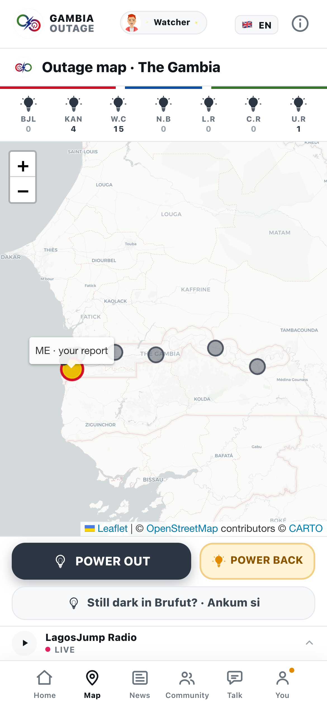 | 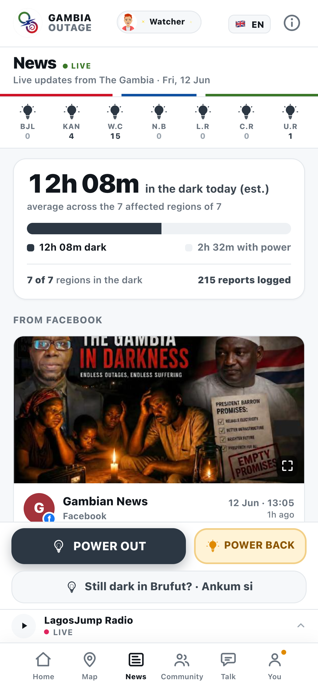 |
| Full Leaflet map of The Gambia with per-area pins and your own report marked **ME**. Lazy-loaded; off by default in data-saver mode. | Live aggregate ("12h 08m in the dark today, average across 7 affected regions") plus auto-tracked posts from Gambian Facebook pages. |

## Regions & quarters

The country is broken into **7 macro-regions and 55 canonical quarters**. Tap any
region for its inline SVG map, or browse every quarter, worst-first.

| Region (macro view) | All 55 quarters | Quarter detail |
|:--:|:--:|:--:|
| 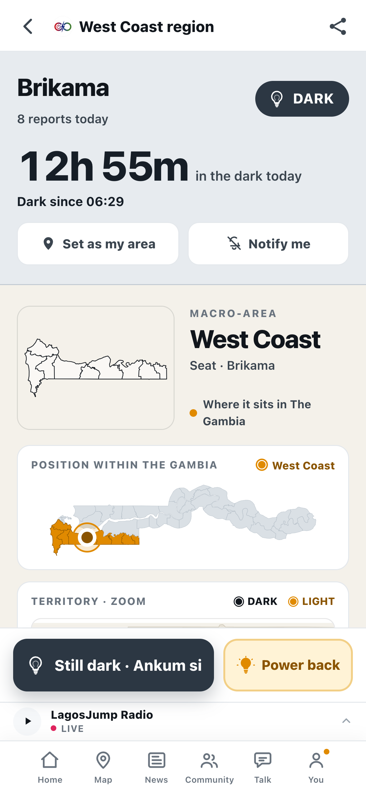 | 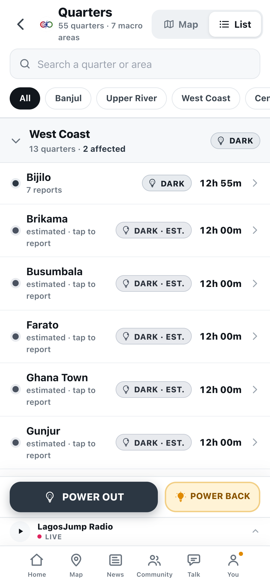 | 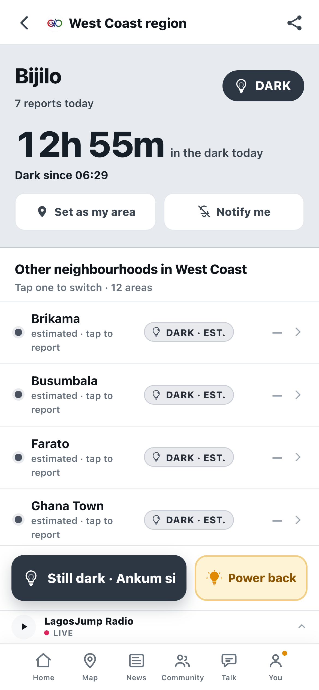 |
| West Coast region — hours-in-the-dark, "dark since" time, *Set as my area* / *Notify me*, and an SVG of where it sits in the country. | Searchable list of all quarters, grouped and filterable by region, each with its live status and duration. | A single quarter (Bijilo) with its current outage and the other neighbourhoods in its region, one tap to switch. |

## Your anonymous identity

A pseudonym lives only on your device. It powers gamification (XP, streaks, badges,
the Wall of Honor) and is **never linked to your reports**.

| Choose a name | Your profile | Wall of Honor |
|:--:|:--:|:--:|
| 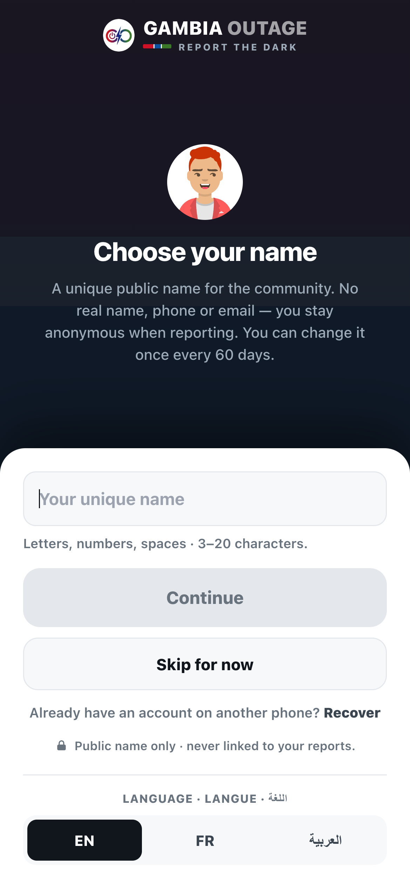 | 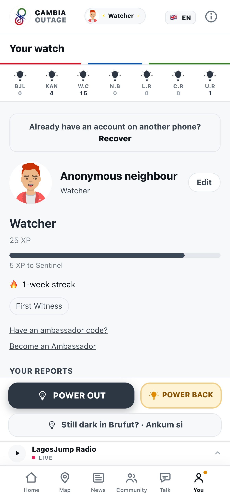 | 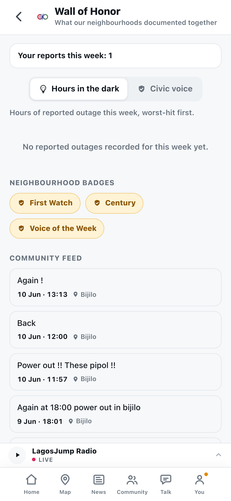 |
| *"Public name only · never linked to your reports."* No real name, phone or email. | XP, rank (Watcher → Sentinel…), streak and badges — all from an on-device account id. | Weekly community recognition, neighbourhood badges, and the live report feed by area. |

## Community

Pseudonymous neighbours, questions, and citizen links — the social layer, kept
strictly separate from the outage-reporting layer.

| Neighbours nearby | Talk (Q&A) |
|:--:|:--:|
| 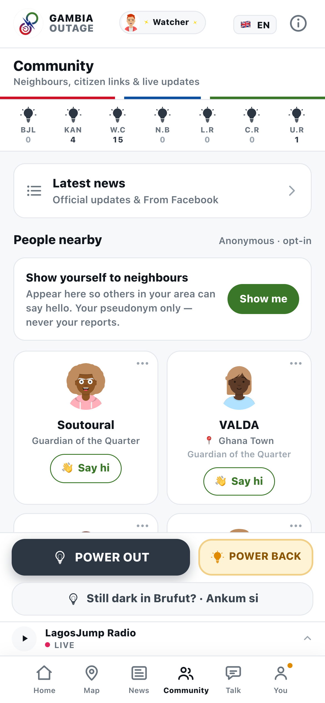 | 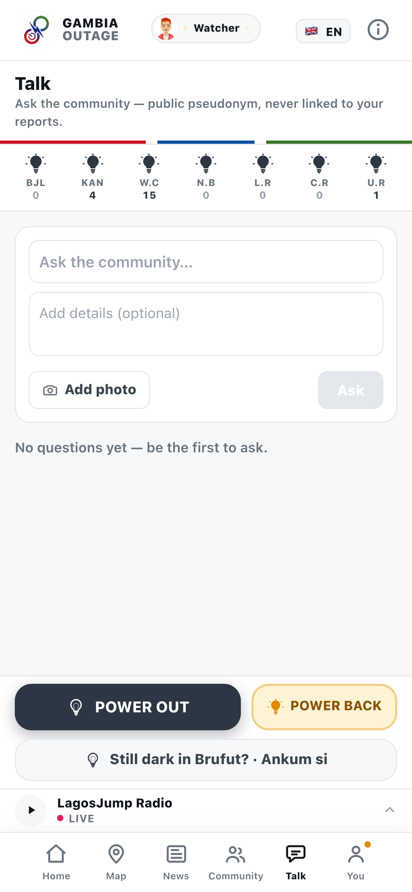 |
| Opt-in presence — *"Your pseudonym only — never your reports."* Say hi to people in your area. | Ask the community anything, with optional photos — public pseudonym, never linked to reports. |

## Languages & radio

| Languages — EN / FR / العربية | Radio — 14 stations |
|:--:|:--:|
| 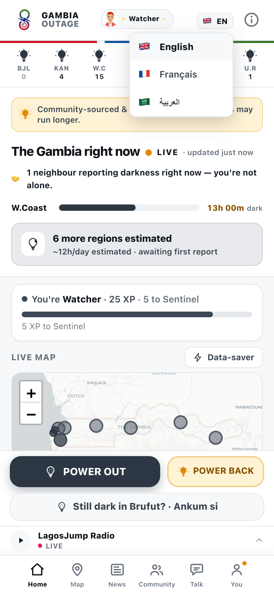 | 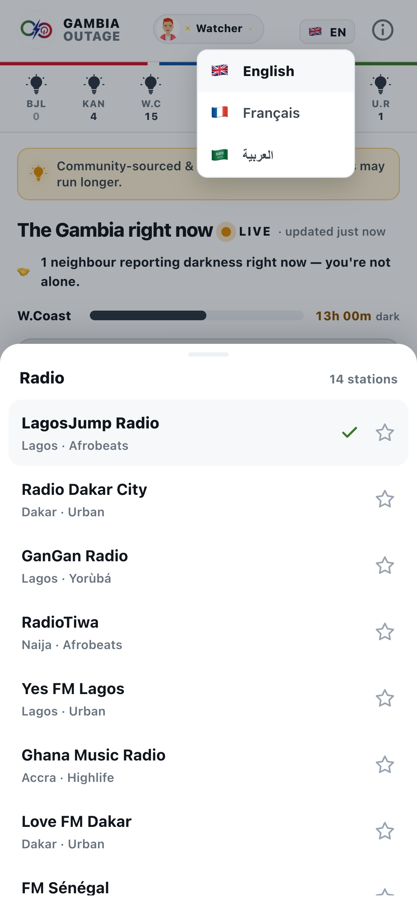 |
| Full UI in English, French and Arabic (with RTL). Wolof & Mandinka are wanted — see [CONTRIBUTING.md](../CONTRIBUTING.md). | A slim radio strip with 14 Gambian & regional stations (Afrobeats, Yorùbá, Highlife, Urban…) and live now-playing metadata. |

---

*Want to see it for real? Open [gambiaoutage.com](https://gambiaoutage.com) on your
phone — or run your own instance from this repo (see the README).*
